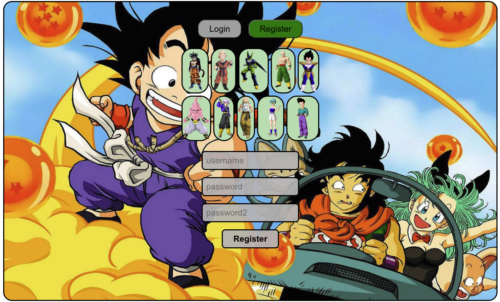
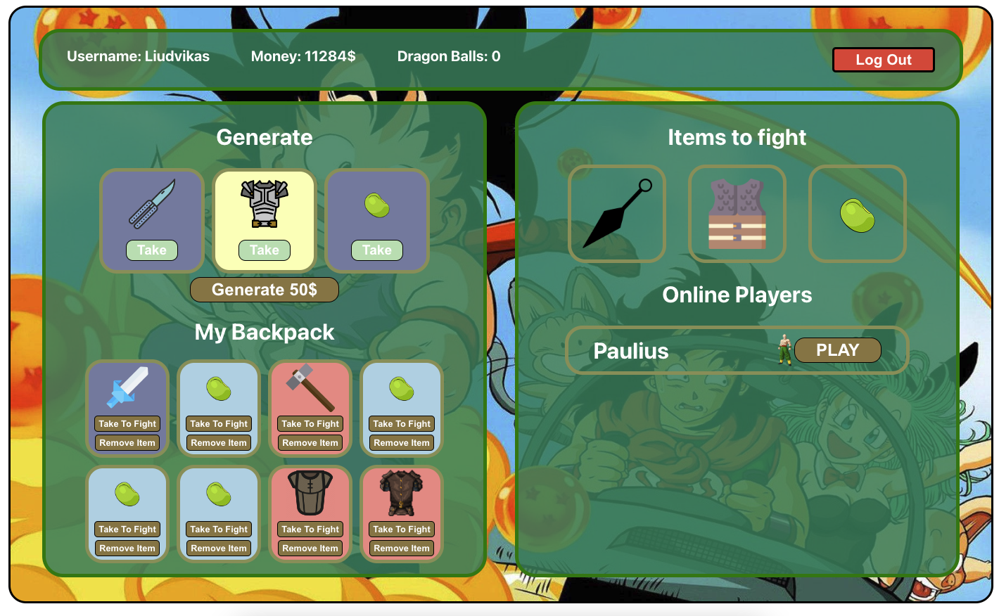

Frontend Development:
For the frontend of the project, the modern and versatile React.js library was employed. The application structure benefits from the seamless page transitions provided by React Router, ensuring smooth navigation throughout. To manage the application's state efficiently, Redux has been incorporated, offering predictable state updates and a centralized store.

Backend Development:
On the backend side, the server has been powered by Node.js, a runtime environment known for its non-blocking, event-driven architecture, making it ideal for scalable applications. Express.js, a minimal and flexible Node.js web application framework, was used to build the server's API endpoints and handle middleware. To ensure real-time bidirectional event-based communication, Sockets.io was integrated, allowing for instantaneous data transfer between the server and the client.

Database:
The choice of database for this project is MongoDB, a widely-adopted NoSQL database that offers flexibility in storing JSON-like documents with dynamic schemas. It is not only efficient in handling large amounts of data but also provides the ability to scale out by sharding data across many servers.